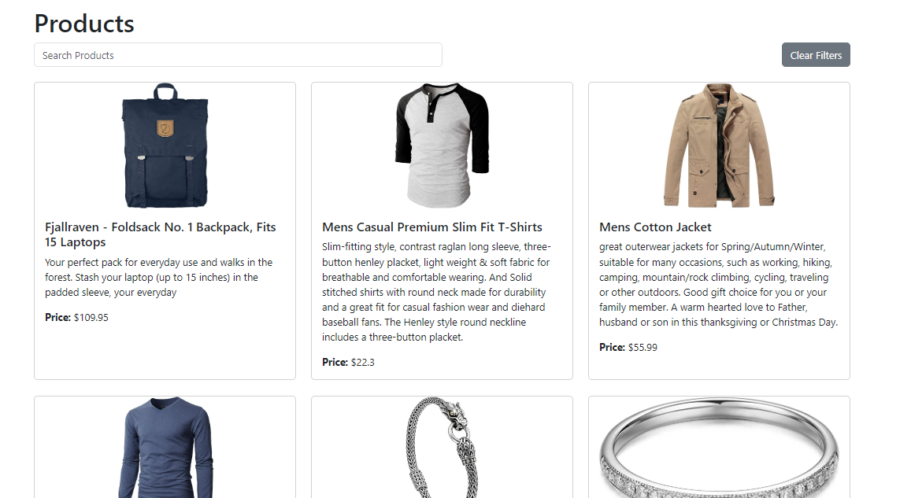
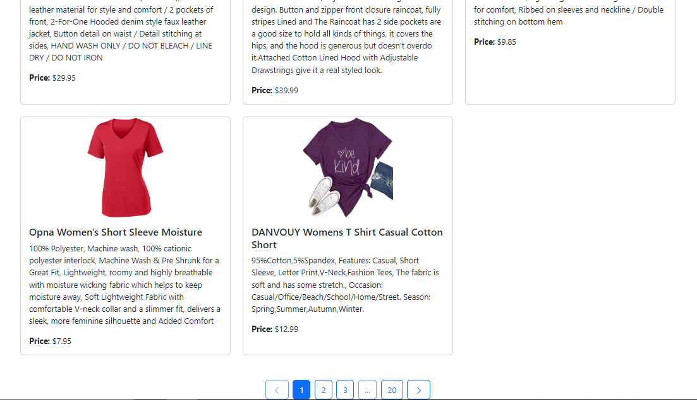

Here’s a **properly formatted and detailed README.md** file for your project. It includes all the necessary sections, placeholders for customization, and clear instructions for setup and usage.

---

# **Product Listing App**

A React-based web application for browsing products with **search**, **pagination**, and **product details** functionality. Built using **React**, **Redux**, **React Router**, and **Bootstrap**.

---

## **Features**

- **Product Listing**:
  - View a paginated list of products.
  - Display **10 products per page**.
- **Search**:
  - Search for products by title using a debounced search input.
- **Product Details**:
  - Click on a product to view its details (title, description, price, and image).
- **Pagination**:
  - Navigate between pages using a user-friendly pagination component.
- **Error Handling**:
  - Display error messages if the API request fails.
- **Responsive Design**:
  - Built with **Bootstrap** for a mobile-friendly UI.

---

## **Technologies Used**

- **React**: Frontend library for building user interfaces.
- **Redux**: State management for managing application data.
- **React Router**: Routing for navigation between pages.
- **Axios**: HTTP client for making API requests.
- **Bootstrap**: CSS framework for styling.
- **Lodash**: Utility library for debouncing search input.

---

## **Screenshots**



### **Product Listing Page**



### **Product Details Page**


---

## **Setup Instructions**

### **Prerequisites**

- **Node.js** (v16 or higher)
- **npm** (v8 or higher)

### **Steps to Run the Project**

1. **Clone the Repository**:

   ```bash
   git clone https://github.com/mudit108/P9-REDUX-API-HUNTER-MUDIT
   cd product-listing-app
   ```

2. **Install Dependencies**:

   ```bash
   npm install
   ```

3. **Start the Development Server**:

   ```bash
   npm start
   ```

4. **Open the App**:
   - Visit `http://localhost:3000` in your browser.

---

## **Project Structure**

```
product-listing-app/
├── public/                  # Static assets
├── src/
│   ├── components/          # Reusable components
│   │   ├── LoadingSpinner.js
│   │   ├── Pagination.js
│   │   ├── ProductDetails.js
│   │   ├── ProductsList.js
│   ├── features/            # Redux slices
│   │   ├── productSlice.js
│   ├── store/               # Redux store
│   │   ├── store.js
│   ├── App.js               # Main application component
│   ├── main.jsx             # Entry point
│   ├── index.css            # Global styles
├── package.json             # Project dependencies
├── README.md                # Project documentation
```

---

## **API Used**

- **FakeStore API**:
  - Base URL: `https://fakestoreapi.com`
  - Endpoint: `/products`
  - Parameters:
    - `_page`: Page number.
    - `_limit`: Number of items per page.
    - `title`: Search term for filtering products by title.

---

## **How It Works**

1. **Product Listing**:

   - The app fetches products from the FakeStore API.
   - Products are paginated, with **10 products per page**.
   - Users can navigate between pages using the pagination component.

2. **Search**:

   - Users can search for products by title.
   - The search input is debounced to reduce unnecessary API calls.

3. **Product Details**:

   - Clicking on a product navigates to its details page.
   - The details page displays the product's title, description, price, and image.

4. **Error Handling**:
   - If the API request fails, an error message is displayed.
   - Users can retry the request by clicking a "Try Again" button.

---

## **Customization**

- To change the number of products per page, update the `productsPerPage` value in the `productSlice.js` file:

  ```javascript
  const initialState = {
    productsPerPage: 10, // Change this value
  };
  ```

- To use a different API, update the `fetchProducts` and `fetchProductsById` functions in the `productSlice.js` file.

---

## **Contributing**

Contributions are welcome! Follow these steps:

1. Fork the repository.
2. Create a new branch:
   ```bash
   git checkout -b feature/your-feature-name
   ```
3. Commit your changes:
   ```bash
   git commit -m "Add your feature"
   ```
4. Push to the branch:
   ```bash
   git push origin feature/your-feature-name
   ```
5. Open a pull request.

---

## **License**

This project is licensed under the MIT License. See the [LICENSE](LICENSE) file for details.

---

## **Contact**

For questions or feedback, feel free to reach out:

- **Email**: mudit@gmail.com
- **GitHub**: mudit108(https://github.com/mudit108)

---

Enjoy using the **Product Listing App**! 🚀

---
